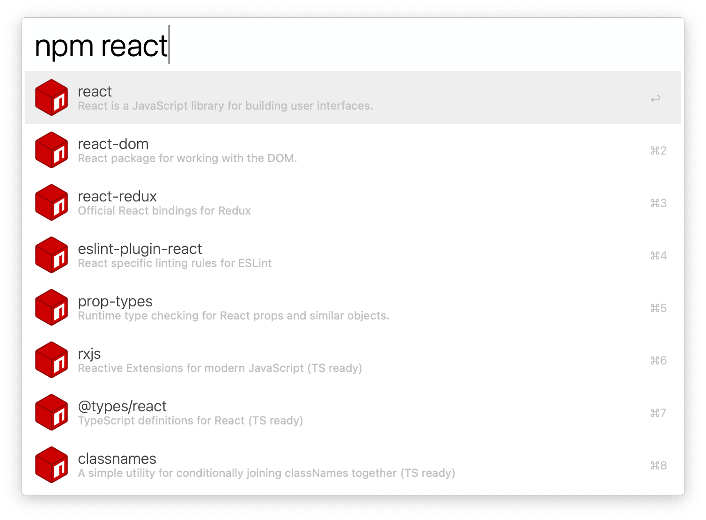

# Alfred npm Search

Alfred workflow to search for npm package using Skypack API.

## Prerequisites

- The [deno](https://deno.land) runtime installed

## How to use

1. Open Alfred App
2. Type `npm`
3. Pass an argument to a script (name of a package)
4. Wait for results
5. Then:
    - `Return` to open on npm website
    - `cmd + c` to copy a link.
